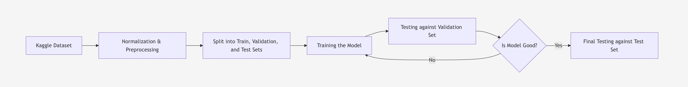

# Lab 2

## 1. Dataset and Machine Learning Problem

**Dataset**: Diabetes Health Indicators Dataset from CDC health surveys (253,680 responses, 22 features)

**Goal**: Predict if someone has diabetes, prediabetes, or no diabetes based on their health data.

**Features include**: BMI, blood pressure, cholesterol, smoking, physical activity, age, income, and more.

## 2. Jupyter Notebook that loads the dataset and displays basic information
- Can be found in `lab2/src/lab2.ipynb`

## 3. The methodology diagram saved as an image

##### Can also be found in `lab2/ml-pipeline-diagram.jpg`